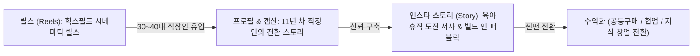

# 📊 [마케팅 보고서] 김동규 대표님 전용 인스타그램 AI 릴스 & 퍼스널 브랜딩 전략

* **작성자**: 대부호 마케팅실장 (Daebuho)
* **수신자**: 김동규 대표님
* **작성일**: 2026년 7월 30일 (**v1.3 전략 수정 브리핑 100% 반영 완결판**)
* **목적**: 11년 차 영업/유통 경험을 **바이오 신뢰 근거**로 활용하고, 힉스필드(Higgsfield) AI 비주얼 도구를 결합한 **사람 중심 퍼스널 브랜딩** 30일 검증 프로젝트

---

## 💡 Executive Summary (핵심 요약)

1. **프로젝트의 정체성 (Higgsfield Personal Brand Experiment)**:
   본 프로젝트는 AI 영상 제작이 목적이 아니라, **김동규라는 사람이 가진 경험과 새로운 도구를 활용하여 어떤 가치와 시장을 만들 수 있는지 발견**하는 프로젝트임.
2. **콘텐츠 철학 (Authenticity & Trust)**:
   과장된 성공이나 가짜 마케팅을 절대 배제. **"성공한 사람의 강의가 아니라 성장하는 사람의 기록"**으로 차별화.
3. **4대 콘텐츠 기둥 재편 (v1.3)**:
   **사람 중심 기둥(전환 스토리·마인드셋·Behind)이 85%**, AI 활용 실험은 15% 조연으로 편성.
4. **영업 11년 경력의 활용법**:
   콘텐츠 주제가 아닌 **바이오(Bio)의 신뢰 근거**로만 활용. 영업 지식 전달형 콘텐츠는 제외.

---

## 👤 1. 김동규 대표님 전용 퍼스널 브랜딩 (Faceless · 사람 중심)

### 🎯 재편된 4대 콘텐츠 기둥 (Content Pillars v1.3)

| 기둥 | 비중 | 목적 | 주요 소재 및 테마 |
| :--- | :--- | :--- | :--- |
| **P1. 전환 스토리** | **40%** | 공감·팔로우 | 육아휴직, 퇴사 결심, 인생 전환기, 11년 차 직장인의 변화 |
| **P3. 마인드셋/실패** | **25%** | 감정 연결 | 돌상대여·위탁판매 부업 실패 교훈, 현금흐름, 아들 축구 꾸준함 |
| **P4. Behind (빌드 인 퍼블릭)** | **20%** | 신뢰·서사 | 사업 만드는 과정, 조회수·수익 공개, 실험·시행착오 |
| **P2. AI 활용 실험** | **15%** | 가치·관심 유입 (조연) | 힉스필드 제작, Claude, 업무 자동화, 생산성 |

> **✅ 브랜딩 원칙**: 사람 중심 기둥(P1·P3·P4) = **85%** / AI(P2) = **15% 조연**. AI는 주제가 아니라 도구.
>
> **❌ 제외**: 영업 노하우·매출/데이터 분석 강의 등 "영업 지식 전달형" 콘텐츠. 영업 11년은 콘텐츠 주제가 아니라 **바이오 신뢰 근거**.

---

## 🎬 2. 수정된 릴스 제작 규격 (v1.3)

| 항목 | 기존 | **수정(v1.3)** |
| :--- | :--- | :--- |
| **영상 길이** | 6~9초 획일 | **P1·P3(스토리/마인드셋) = 7~15초** / **P2·P4(AI/Behind) = 15~30초** |
| **저장률 목표** | 3~12% | **1~3%면 우수** (평균 0.3~0.5%) |
| **게시 빈도** | 1일 2~3회 강제 | **매일 1회 기본**, 지속 가능 범위에서 증량 |
| **영상 구조** | — | **1초 Hook → 3초 문제 → 스토리 → 가치 → CTA** |
| **알고리즘 우선** | — | **Watch time(완독률+총 시청시간) → Private Engagement(저장·공유·DM)** |

* 9:16 세로 · 자막 전체 삽입 · 트렌드 음원 · Faceless(뒷모습·손·실루엣·작업환경)
* 45초 이상 지양

---

## 🎬 3. 유효 릴스 세트 (Week 1 발행용)

### 📌 릴스 1호 (P1 전환 스토리): 11년 차 영업 과장의 퇴사 준비
* **힉스필드 Prompt**:
  > `Cinematic 8k shot of a man's back sitting at a dark office desk at night looking out at neon skyscraper city lights, slow camera zoom in, hyper-realistic, calm atmospheric mood`
* **화면 텍스트**: *"11년 차 영업 과장이 퇴사 준비하며 깨달은 것"*
* **길이**: 7~15초
* **본문 캡션**:
  > 11년 동안 회사에 바친 시간... 하지만 육아휴직 중 깨달았습니다. 회사가 내 인생을 영원히 책임져주지 않는다는 것을. 힉스필드 결제 실수로 시작된 1인 기업가 30일 도전기 1일 차! 🚀
  > 평범한 직장인도 새로운 도구로 새로운 가능성을 만들 수 있음을 증명하겠습니다.
  > 📌 나중에 다시 보려면 저장(Save)해 두세요!
  > #직장인성장 #육아휴직 #퇴사준비 #1인기업가 #30일챌린지

### 📌 릴스 3호 (P2 AI 활용 실험): AI가 일자리를 뺏는 게 아닙니다
* **힉스필드 Prompt**:
  > `Cinematic wide shot of a futuristic dark room with glowing dual monitors displaying AI video generation progress, slow camera pan, hyper-realistic 4k`
* **화면 텍스트**: *"AI가 일자리를 뺏는 게 아닙니다"*
* **길이**: 15~30초
* **본문 캡션**:
  > AI가 사람을 대체하는 것이 아니라, AI를 활용하는 사람이 그렇지 않은 사람을 대체합니다. 힉스필드로 시네마틱 릴스를 만드는 1인 기업가 생산성 실험 중! 🤖
  > 📌 AI 활용법이 궁금하시다면 저장(Save)해 두세요!
  > #AI활용 #힉스필드 #생산성향상 #1인창업 #자동화시스템

### 📌 릴스 4호 (P3 마인드셋/실패): 부업 실패를 딛고 깨달은 성장의 법칙
* **힉스필드 Prompt**:
  > `Dramatic silhouette of a person standing at a misty soccer stadium field at dawn looking at bright stadium lights, slow motion dolly forward, epic mood 8k`
* **화면 텍스트**: *"부업 실패를 딛고 깨달은 성장의 법칙"*
* **길이**: 7~15초
* **본문 캡션**:
  > 위탁판매와 돌상 대여 사업의 시행착오를 거치며 배웠습니다. 그리고 매일 축구 훈련을 받는 아들을 보며 다시 확신했습니다. 성장은 하루아침에 이루어지지 않는다는 것. 꾸준함이 비범함을 만듭니다. 🔥
  > 📌 지칠 때마다 꺼내보려면 지금 저장(Save)해 두세요!
  > #성장마인드셋 #실패는자산 #꾸준함의힘 #직장인성장 #동기부여

### 📌 릴스 5호 (P1 전환 스토리): 나는 유명해지기 위해 사업하지 않는다
* **힉스필드 Prompt**:
  > `Cinematic back view of a person walking through a quiet rainy city street with an umbrella under warm streetlights, slow camera dolly in, 8k`
* **화면 텍스트**: *"나는 유명해지기 위해 사업하지 않는다"*
* **길이**: 7~15초
* **본문 캡션**:
  > "내가 원하는 삶과 시간의 선택권을 만들기 위해 사업한다." 3년 후 월급 외의 독자적 브랜드를 갖기 위한 솔직한 실행 기록. 🚀
  > 📌 함께 성장할 3040 직장인 분들은 팔로우하고 함께해 주세요!
  > #경제적자유 #시간자유 #퍼스널브랜딩 #직장인성장 #30일챌린지

### 📌 릴스 7호 (P4 Behind · 빌드 인 퍼블릭) — **신규**
* **힉스필드 Prompt**:
  > `Cinematic shot of a dim room with a wall of sticky notes and a rising growth chart, a person's back planning at a desk with a glowing laptop, warm focused light, 8k hyper-realistic`
* **화면 텍스트**: *"0명에서 시작하는 30일, 전부 공개합니다"*
* **길이**: 15~30초
* **본문 캡션**:
  > 성공한 다음 자랑하는 계정이 아닙니다. 팔로워 0명에서 시작하는 30일 도전을 조회수·저장·시행착오까지 그대로 공개합니다. 📈
  > 평범한 직장인이 새로운 도구로 무엇을 만들 수 있는지, 실시간으로 증명해 보이겠습니다.
  > 📌 이 여정을 함께 지켜보려면 팔로우!
  > #빌드인퍼블릭 #30일챌린지 #성장기록 #직장인성장 #퍼스널브랜딩

---

## 🎣 4. 유형별 폭발 훅 A/B 뱅크

Week 1 훅 A로 발행 → 반응 보고 저평가 유형은 Week 2 훅 B로 재도전. 터진 훅 = 폭발 릴스 후보로 변주 집중.

| 기둥 | 훅 A (감정·긴장) | 훅 B (숫자·호기심) |
| :--- | :--- | :--- |
| **P1 전환** | "육아휴직이 끝나면 회사로 안 돌아갑니다" | "11년 다닌 회사를 떠나기로 한 3가지 이유" |
| **P2 AI** | "AI가 일자리를 뺏는 게 아닙니다" | "퇴근 후 2시간, AI로 릴스 10개 만든 법" |
| **P3 마인드셋** | "돌상 사업하다 대출까지 갔습니다" | "부업 4번 말아먹고 배운 1가지" |
| **P4 Behind** | "0명에서 시작하는 30일, 전부 공개합니다" | "이번 주 조회수·저장 수 그대로 보여드립니다" |

---

## 📈 5. 수정된 목표 & KPI (v1.3)

**메인 목표**: 30일 내 팔로워 10,000명 (공격적 추진 목표)

**1만 팔로워를 뚫는 3대 엔진**:
1. **폭발 릴스(조회 10만+) 1~2개 확보** — 4유형 × 훅 A/B로 터지는 훅 발굴.
2. **매일 발행 + 알고리즘 학습 가속** (힉스필드 배치 제작으로 지속가능하게).
3. **첫 3초 훅 + 저장 유도 최적화** — 완독률 50%+ 목표.

| KPI | 목표 | 비고 |
| :--- | :--- | :--- |
| **완독률 (Completion)** | **50%+** | 알고리즘 추천의 핵심 |
| **저장률 (Save Rate)** | **1~3%면 우수** | 평균 0.3~0.5%, 3% 이상은 이례적 |
| **공유·DM** | 추적 | 신뢰 깊이 지표 |
| **프로필 방문 → 팔로우 전환** | 추적 | 바이오 최적화 효과 |

> **현실 인지**: 신규 계정 통상 1개월 0~500명, 10K는 4~6개월. 30일 1만은 아웃라이어 — 폭발 릴스 전략으로 추진.

---

## 🔍 6. 벤치마킹 참고 계정 (Reference Handles)

* **`@visualsk2`**: AI 시네마틱 릴스 0~2초 비주얼 훅 레퍼런스.
* **`@virtualverseai`**: 딥 다크 모드 톤앤매너와 브랜드 가치 형성.
* **`@mindset.vibe` / `@wealth`**: 3초 훅 텍스트 + 고화질 배경 영상 융합.
* **`@motiversity`**: 캡션 하단 저장(Save) 유도 및 텍스트 브랜딩.
* **`@rozy.gram`**: AI 비주얼 기반 브랜딩 및 스폰서십/협찬 유입.

---

## 🚫 7. 폐기(하지 말 것) 목록

- ❌ **영업 지식 전달형 콘텐츠** (영업 노하우·매출/데이터 강의·미래생활 성과 자랑) — 콘텐츠 주제 사용 금지
- ❌ 영상 6~9초 획일 적용
- ❌ 저장률 3~12%를 기준치로 제시 (과장)
- ❌ 1일 2~3회 게시 강제 (지속가능성 위반)
- ❌ 계정명 `@vision.mindset` / `#비전마인드셋`
- ❌ `#김동규대표` 해시태그 (Faceless·North Star와 충돌)
- ❌ 미검증 벤치마크 수치를 확정 사실처럼 제시

---

## ✅ 8. 유지(잘한 것) 목록

- ✅ Higgsfield Personal Brand Experiment 프레이밍
- ✅ 타깃 30~40대 직장인 / Faceless / 과장 배제
- ✅ 실제 경험 자산 기반 릴스 1·3·4·5호
- ✅ 저장·완독률 중시 원리
- ✅ 영업 11년 경력은 **바이오의 신뢰 근거**로 계속 활용 (단, 콘텐츠 주제가 아니라 배경)

---

## 📅 9. 30일 검증 체크리스트

- [x] **6대 마스터 헌법 체계 구축 완료** (`00~03`, `NORTH_STAR`, `PROJECTS`)
- [x] **v1.3 전략 수정 100% 반영 완료** (콘텐츠 기둥 재편, 제작 규격 현실화, 폐기/유지 정리)
- [x] **유효 릴스 5종 + 훅 A/B 뱅크 구축 완료**
- [x] **계정명 확정**: `@plan_b.log` (플랜비 로그)
- [ ] **1주차**: 계정 개설 및 프로필 바이오 세팅 + 릴스 1·3·4·5·7호 발행
- [ ] **2주차**: 매일 1회 포스팅 + 훅 A/B 반응 데이터 분석
- [ ] **3주차**: 터진 훅 기반 폭발 릴스 변주 집중
- [ ] **4주차**: 30일 데이터 분석 및 2차 목표(시장 반응 확인) 수립

---

*본 보고서는 대부호 마케팅실장에 의해 지속적으로 업데이트되며, 대표님의 퍼스널 브랜드 검증 시까지 밀착 보좌합니다!*
